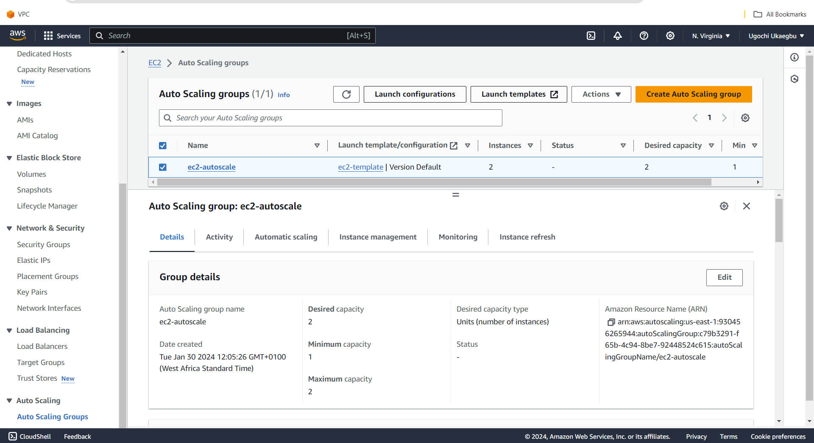
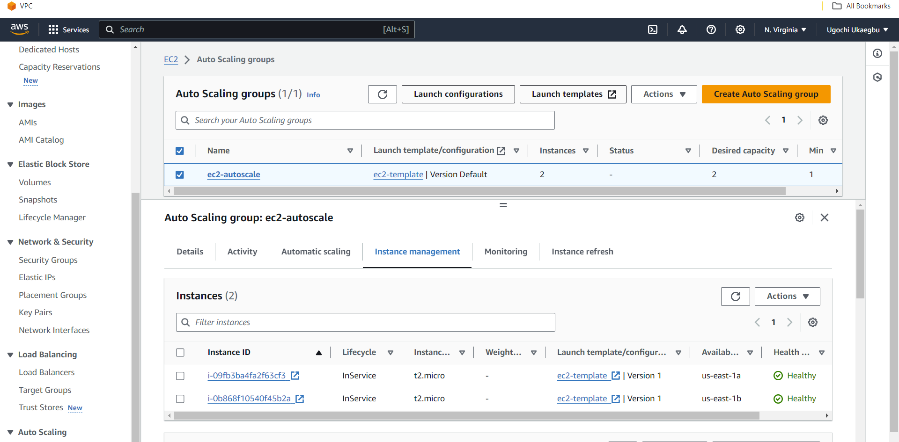
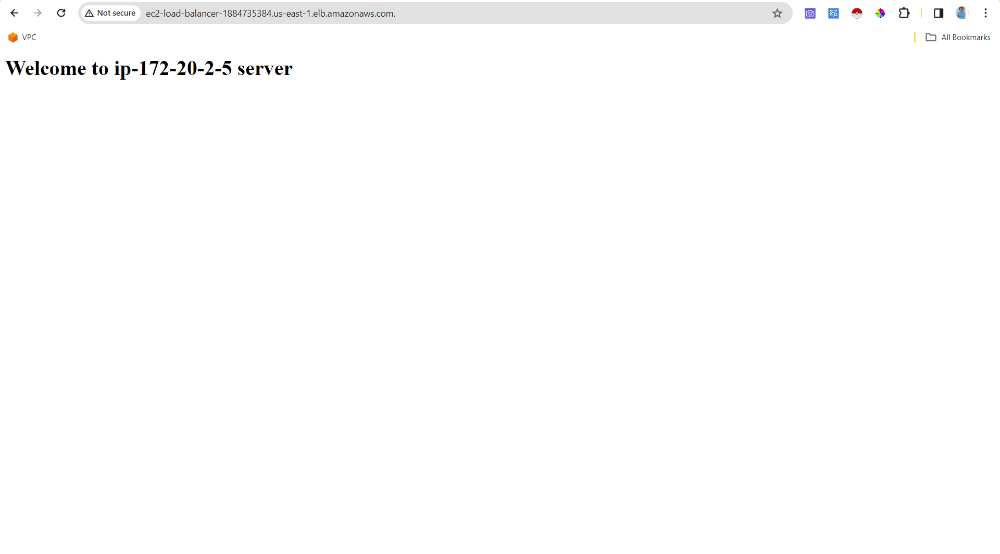
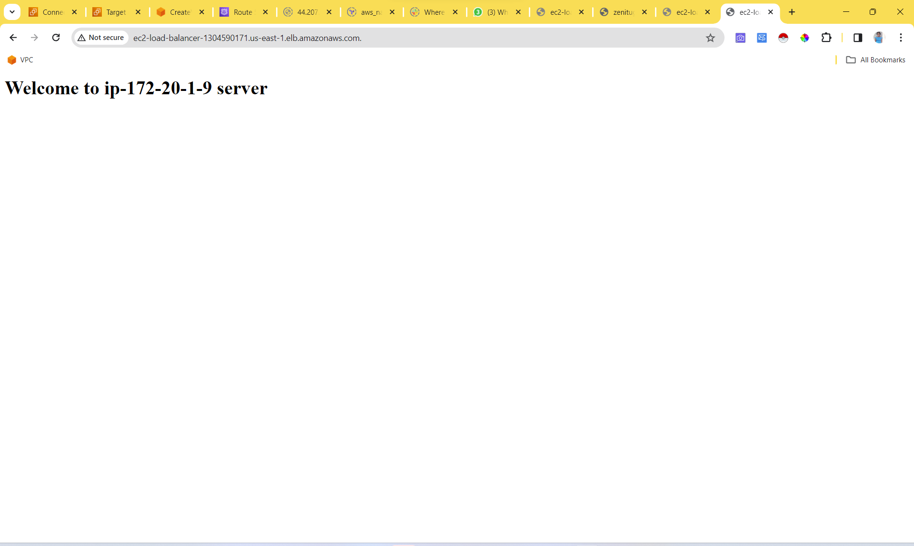
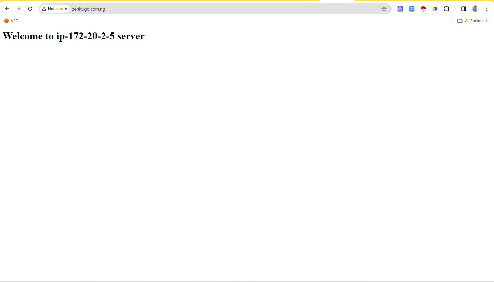
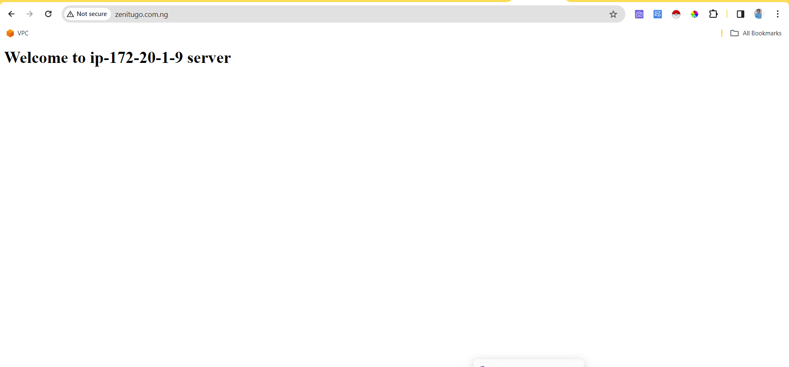

# INTRODUCTION
This project focuses on using terraform to provision two privatew servers within an autoscaling group using an ec2 launch template and accessing the content of each servers through a load balancer dns name or domain name attached to the load balancer.

# DEEP DIVE INTO THE PROJECT
[happy](https://giphy.com/clips/theoffice-dvDiC9t2Ed2z5hYkgb.gif)

The project is in two fold:
1. Using terraform to create infrastructure in aws account.
2. Using Ansible to configure each server.

##  TERRAFORM INFRASTRUCTURE CREATION 
Terraform is a tool for building, changing, and versioning infrastructure safely and efficiently. Terraform can manage resources on AWS, Azure and Google Cloud Platform; but for this project terraform was used to create infrastructure on AWS.

### STAGES IN EXCUTION

One of the aim of this project was to make the code reusable  and modular, so that different modules can be used for different environments (dev, staging, prod). The assumption of this project is that it was created in the dev environment.

This also required the project had different sub-directories under the `/terraform-autoscale/child-modules` directory, with each representing a separate stage of execution. These stages includes:
- creating a VPC.
- creating an ec2 template.
- creating an autoscaling group.
- creating a bastion server.
- creating a load balancer.
- creating a record in route53.

#### DEV SUB-DIRECTORY
This directory holds different files that:
1. Tells terraform the cloud povider it should use. In this case (AWS)
2. Specifies the region that should be used in AWS
3. Contains variables for the application, such as app version, cidr-block and environment name. 
4. Also by setting them directly into the tfvars file, so that if anyone wants to fork this project from Github, they can input their values in the `terraform.tfvars` file

#### CHILD-MODULES SUB-DIRECTORY
This  directory contains modules which are reusable pieces of code.  They can be imported into other projects or used within this one. The reason they're kept separate.

The **first infrastructure** to be created  was the `vpc`. This module contains all the code needed to create a basic virtual private network.

Since the task was to create a private servers within an autoscaling group, a `NAT GATEWAY` was created. The Nat gateway was created in the public subnet and associated to the IPS in the private subnet and a route to the nat gateway was defined within the private route tables.

This also required that an `elastic Ip` needed to be created before the `NAT GATEWAY`.

**Note:**
- At this stage the VPC, subnets, route tables, and internet gateway was created.
- The public subnets were associated with the internet gateway using the route tables.

The  **second infrastructure** to be created was the `bastion server` because its impossible to ssh into private servers from your local computer; so an ec2 instance that has been auto assigned an IP from AWS is needed to ssh into ec2 private servers. 

Like any ec2, security groups were created with port 22 with a `cidr_block of 0.0.0.0/0` so that it can ssh into any instance.

Also since the project used an already existing key pair, a folder called `key-folder` was placed in the `bastion-sever module` where you can place your private key-file that will be used to ssh into the private servers.

The **third infrastructure** to be created was the `instance template`. In order to create an autoscaling group, you need to have a template that will be used by the autoscaling group.

The **fourth infrastructure** to be created was the `auto-scaling group`. With Autoscaling group you can launch a fleet of ec2 instance, specifying the minimum and maximum instances you can have at a time. For this project the maximum instances was two.

**Images of the auto scaling group and the ec2 launch templates attached to it.**

The **fifth infrastructure** to be created was `load-balancer`. With load balancer, you can  distribute network traffic across multiple targets, such as Amazon EC2 instances or containers. Load balancer makes it possible to view contents in a private server.

But for this to work: 
- the public subnets have to be attached to the load balancer.
- the target group needs to be created and attached to the autoscaling group.
- a security group for the load balancer needs created.
- a listener needs to be created and attached to the load balancer at port 80
- and a command needs to be given to forward connectivity request to the target group.

**Image showing how the load balancer**

The **sixth step** was to create a `record in the hosted zone`. This was done by querying AWS infrastructure to get the hosted zone and create an A record taht would be attached to it.

### IMAGES OF THE WEB CONTENT ON THE PRIVATE SERVERS

**USING LOAD BALANCER DNS NAME**

**USING DOMAIN NAME**

### COMMANDS USED IN THIS PROJECT
- terraform init
- terraform plan -var-file="terraform.tfvars"
- terraform apply -auto-approve
- terraform destroy -auto-approve

## ANSIBLE CONFIGURATION AND AUTOMATION
Ansible is configured in the `ansible` directory. It uses an inventory file that contains information about the servers where Ansible will run commands on. This includes IP, hostnames, and connection-type.

Also it makes use of a configuration file and a playbook that will be used to provision the servers.

The ansible directory was placed in the bastion-server module and `terraform null resources/ file provison` was used to send the files into the bastion instance.

The bastion ec2 was used to provision the private servers and the key file permissions was set to 400 using the command `sudo chmod 400 <key-file-name>`

**The command used to automate this process is: ansible-playbook -i host.ini playbook.yml**

## CONCLUSION
In conclusion, an AWS environment was created using IAC tool called `terraform` which includes two EC2 instances within an autoscaling group as the private servers and one Load Balancer in front of them. 

An AWS ALB (Application Load Balancer) has been implemented in order to distribute incoming traffic across multiple targets that is; the EC2 instances . 